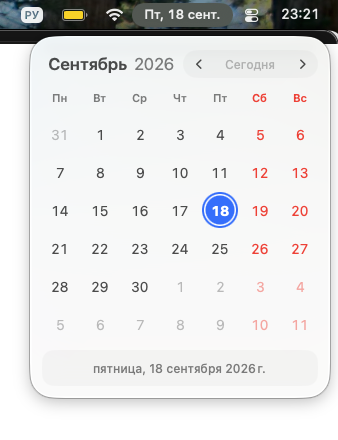
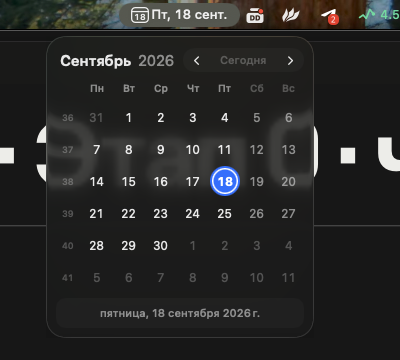
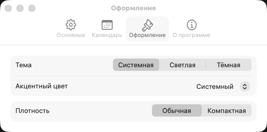

# MenuCal

A small calendar for the macOS menu bar. Keep the date in the format you like, click it to
see the month, and check dates without opening a full calendar app.

**[Download MenuCal](https://github.com/shumer/iCalendar/releases/latest)** ·
[Installation](#install) · [How to use](#how-to-use) · [Settings](#make-it-yours) ·
[Build from source](#build-from-source)

## A look inside

| Light, regular size | Dark, compact size with week numbers |
| :---: | :---: |
|  |  |

Real app screenshots on macOS 26, with the Russian interface. Both themes support Regular
and Compact sizes. The translucent background picks up what is behind the calendar.

## What it does

- **Your date, your format.** Five presets, a custom date pattern with a live preview, and an
  optional calendar or day number icon in the menu bar.
- **A month at a glance.** Browse with the mouse, keyboard or trackpad. Show week numbers,
  highlight weekends, and see the full selected date below the grid.
- **Public holidays.** Mark nationwide public holidays in red, using your system region or a
  country you choose. Hover over a holiday or select it to see its name.
- **Events.** The events of the calendars in System Settings > Internet Accounts, read only:
  a dot per group of calendars under the day, and a click opens the day's list. Groups, their
  colours and which calendars go where are in **Settings > Events**.
- **Vacation.** Mark your own days off: click the first day, Shift-click the last and press
  **Vacation**, or right-click a day. They show as a green band and stay on your Mac.
- **A native macOS look.** Light, Dark or System appearance, your system accent or a custom
  colour, and Regular or Compact spacing. Liquid Glass on macOS 26 and later, with a material
  fallback on older supported versions.
- **Ready when you need it.** Optional launch at login and a global keyboard shortcut.
- **Follows your Mac.** Uses your calendar, region and time zone. The interface is available
  in English, Russian, Ukrainian and Polish.

MenuCal is a date lookup tool. It does not manage events, reminders or accounts, or sync with
Apple Calendar or Google Calendar.

## Install

Requires **macOS 14 Sonoma or later**.

1. Open the [latest release](https://github.com/shumer/iCalendar/releases/latest) and download
   `MenuCal-<version>.dmg` from **Assets**.
2. Open the disk image and drag **MenuCal** into **Applications**.
3. Open **MenuCal** from Applications, then eject the disk image.
4. Look for the date in the menu bar and click it. There is no Dock icon or main window.

Official releases are signed with a Developer ID and notarised by Apple. No account or setup
wizard is needed. On first launch, MenuCal uses your system appearance and region and shows
the date with the weekday.

To start it automatically, right-click its menu bar date, open **Settings > General**, and
enable **Launch at login**. If macOS asks for approval, use **Open Login Items** in that pane.

## How to use

- **Click the menu bar date** to open or close the calendar.
- **Click the header arrows**, scroll, or swipe on a trackpad to browse months.
- **Click a day** to select it. Its full date appears at the bottom when the full date line
  is enabled. Selecting a day does not create an event.
- **Click Today** to return to the current date.
- **Press Esc or click outside** to close the calendar.
- **Right-click or Control-click the menu bar date** for Settings, About, updates and Quit.

### Keyboard shortcuts

These work while the calendar is open:

| Key | Action |
| --- | --- |
| Left / Right | Move focus by one day |
| Up / Down | Move focus by one week |
| Return / Space | Select the focused day |
| Option + Left / Right | Previous / next month |
| Command + Shift + Left / Right | Previous / next year |
| T or Command + T | Go to today |
| Esc | Close the calendar |

To open the calendar from anywhere, go to **Settings > General > Global shortcut**, click
**Record Shortcut**, and press your preferred combination. No global shortcut is assigned
by default. If the combination is already taken, choose another one.

## Make it yours

Right-click the menu bar date and choose **Settings**. Changes are saved and applied as you
make them.

| Pane | What you can change |
| --- | --- |
| **General** | Date format, menu bar icon, launch at login, global shortcut and automatic update checks |
| **Calendar** | First day of the week, week numbers, full date line, weekend highlighting, public holidays and country, current or last viewed month on opening |
| **Events** | Calendar access, groups of calendars with colours and dots, marks in the grid, your vacations with names |
| **Appearance** | System / Light / Dark theme, system or custom accent colour, Regular / Compact size |
| **About** | Version and update status |



### Date format

Choose **Date only**, **Date + weekday**, **Date + time**, **Compact** or **Full** for a format
that follows your locale. You can also edit **Pattern** directly and watch **Preview**.

For example, with an English locale on September 18, 2026 at 14:30:

| Pattern | Example |
| --- | --- |
| `EEE, d MMM` | Fri, 18 Sep |
| `yyyy-MM-dd` | 2026-09-18 |
| `d MMM HH:mm` | 18 Sep 14:30 |

Patterns use Unicode date format symbols. Letter case matters: `MM` is the month and `mm`
is minutes. If a pattern is invalid, MenuCal keeps the last working format.

### Events

MenuCal never asks for a password or a token: it reads the calendars macOS already has. Allow
access once in **Settings > Events**; a work account appears only if it has been added to macOS
in Internet Accounts. Each account becomes a group with a colour; **Edit…** on a group changes
its name and colour and picks its calendars, and its **Show** menu decides whether the group
gets a dot under the days and a place in the day's list, the list only, or neither for now.
The calendars of a group are listed under it: untick the ones you do not want to see. A day with events opens its list when clicked: chips under the date narrow it to one group for
a quick look (click again for all), each row shows when the event starts and ends, and a double
click on an event opens it in Calendar.

### Vacation

Click the first day of your vacation, Shift-click the last one and press **Vacation** in the
footer. Shift and the arrow keys do the same from the keyboard, and a right-click on any day
marks or unmarks that day alone. Vacations are a green band behind the days; a public holiday
inside one stays red. **Settings > Events** lists them, lets you name, add or delete them, and can
hide them all. Nothing about them leaves your Mac.

### Public holidays

In **Settings > Calendar**, turn on **Mark public holidays in red** and choose **System
region** or a specific country. MenuCal shows nationwide official days off, excluding
regional, school and bank-only holidays and observances.

Holiday names appear in tooltips and in the full date line when a holiday is selected.
Lists come from Nager.Date and are cached locally. If the network is unavailable, cached
holidays remain visible; dates without a downloaded list still work as a normal calendar.
You can turn holiday marking off at any time.

## Updates

MenuCal checks GitHub for new releases when **Check for updates automatically** is enabled.
You can also right-click the menu bar date and choose **Check for Updates**.

When a release is available, **Update to &lt;version&gt;** appears at the top of that menu. Click
it to download, verify and install the update. MenuCal then relaunches. Official builds check
that the replacement has the same app identifier and Developer ID team and a newer version.

If the app cannot replace its own copy, it opens the release page so you can install the
new version manually. Run it from Applications, rather than from the mounted disk image.

## Privacy and offline use

The calendar and date formatting work offline. MenuCal does not request access to your
personal calendars or use an account, analytics or tracking SDKs.

Its network features are public holiday downloads from `date.nager.at` and update checks
and downloads from GitHub. Holiday requests identify the country code and year, using your
region setting rather than location services. Current and future holiday lists are refreshed
after about 30 days. Both holiday marking and automatic update checks can be turned off in
Settings.

## Common questions

**Why is there no window when I launch MenuCal?**

It lives in the menu bar. Click its date to open the calendar, or right-click it for Settings.

**Can it replace or hide the macOS clock?**

MenuCal adds its own item. To adjust the system clock, use **Open Clock Settings** in
**Settings > General**. Hold Command and drag MenuCal's item to reposition it in the menu bar.

**Why are some holidays missing?**

Check the country in **Settings > Calendar** and allow an internet connection for the first
download. Only nationwide public holidays returned by the service are shown.

**How do I quit or uninstall it?**

Right-click its date and choose **Quit MenuCal**. To uninstall, turn off **Launch at login**,
quit the app, and move MenuCal from Applications to the Trash.

## Build from source

For development, use a Swift 6 toolchain with the macOS 26 SDK or newer, which provides the
Liquid Glass APIs. Apple's Command Line Tools are enough; a full Xcode installation is not
required. The local toolchain documented in CLAUDE.md uses the macOS 27 SDK. The app's deployment
target remains macOS 14. There are no third-party dependencies.

```bash
xcode-select --install
git clone https://github.com/shumer/iCalendar.git
cd iCalendar
./build.sh --no-install
open MenuCal.app
```

If Command Line Tools are already installed, skip the first command. Otherwise, finish their
installation before running the remaining commands.

`build.sh` runs the tests, builds the release executable, assembles the app and signs it.
With `--no-install`, it leaves `MenuCal.app` in the repository. Run `./build.sh` without that
flag to install into `/Applications` and launch it, replacing an existing copy.

The script uses a Developer ID from your keychain when available, or ad-hoc signing otherwise.
To explicitly make a local ad-hoc build:

```bash
CODESIGN_IDENTITY=- ./build.sh --no-install
```

Local builds are not notarised. See the [release guide](docs/release.md) for distribution.

### Tests

```bash
./run-tests.sh
./run-tests.sh --coverage
```

The coverage command checks an 80% minimum line coverage for `MenuCalCore`. Tests run as the
`MenuCalTests` executable, without XCTest or swift-testing. See the
[toolchain decision](docs/adr/0001-spm-only-toolchain.md) for details.

### Project guide

| Path | Contents |
| --- | --- |
| `Sources/MenuCalCore` | Calendar calculations, date formatting, preferences and update policies |
| `Sources/MenuCal` | Menu bar item, calendar panel, settings and native appearance |
| `Sources/MenuCalTests` | Test suite |
| `Resources/Localizations` | English, Russian, Ukrainian and Polish strings |
| `Resources/AppIcon` | App icon, generated by `Scripts/make-icon.swift` |
| `Scripts` | Icon, disk image and notarisation helpers |

For more context, see the [design specification](docs/DesignSpec.md),
[roadmap](docs/roadmap.md), [manual test checklist](docs/manual-checklist.md),
[release guide](docs/release.md) and [contributor instructions](CLAUDE.md).
